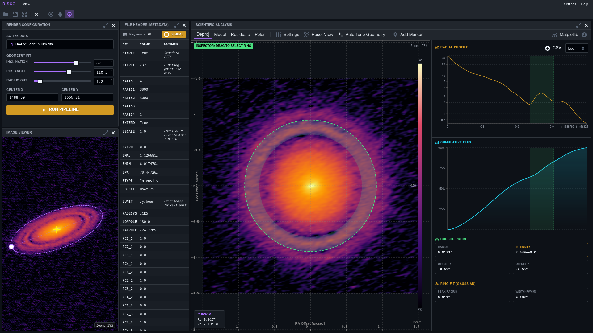

.. DISCO documentation master file

DISCO — Deprojection Image Software for Circumstellar Objects
=============================================================

|

.. note::

   **DISCO** (v1.2.3) is an open-source Python package for the analysis and physical
   characterisation of protoplanetary disk observations from ALMA FITS data.
   This software is currently in active development.

DISCO integrates a convolutional neural network (DiscoNet) for rapid geometric
parameter prediction with a hybrid numerical optimisation strategy, enabling
robust deprojection and azimuthally-averaged radial profile extraction from
continuum FITS images.

Two complementary operational modes are provided: a **command-line interface**
(``disco-start``) designed for batch processing and reproducible automated
pipelines, and a **web-based GUI** (``disco-start gui``) for interactive,
exploratory analysis.

Two Modes of Operation
----------------------

.. list-table::
   :header-rows: 1
   :widths: 40 30 30

   * - Feature
     - CLI (``disco-start``)
     - GUI (``disco-start gui``)
   * - DiscoNet (CNN) geometry
     - ✅
     - ❌
   * - Interactive visualisation
     - ❌
     - ✅
   * - Batch processing
     - ✅
     - ❌
   * - Multi-band support
     - ✅
     - ❌
   * - Beam homogenisation
     - ✅
     - ❌
   * - SIMBAD query
     - ❌
     - ✅
   * - Session save / restore
     - ❌
     - ✅
   * - Ease of use
     - Moderate
     - High

The **GUI** is recommended for exploratory analysis and first-time users.
The **CLI** is designed for reproducible, automated pipelines.

Citation and Acknowledgements
----------------------

If you use DISCO in published work, please cite this repository and acknowledge **Jorge Luis Guzmán-Lazo**, who developed the software within the `YEMS Millennium Nucleus <https://www.milenioyems.cl/>`_ under the supervision of **Sebastián Pérez** and **Camilo González-Ruilova**.

**Contact:** jorge.guzman.l@usach.cl

If you use DISCO in your research, please cite the associated Zenodo record:

Guzmán-Lazo, J. L. (2026). *DISCO: Deprojection Image Software for Circumstellar Objects* (v1.2.3). Zenodo. https://doi.org/10.5281/zenodo.19999239

.. code-block:: bibtex

   @software{guzman_lazo_2026_19999240,
     author    = {Guzmán-Lazo, Jorge Luis},
     title     = {DISCO: Deprojection Image Software for Circumstellar Objects},
     year      = {2026},
     version   = {v1.2.3},
     publisher = {Zenodo},
     doi       = {10.5281/zenodo.19999239},
     url       = {https://doi.org/10.5281/zenodo.19999239}
   }

DISCO was developed by **Jorge Luis Guzmán-Lazo** within the `YEMS Millennium Nucleus <https://www.milenioyems.cl/>`_ under the supervision of **Sebastián Pérez** and **Camilo González-Ruilova**.

----

.. toctree::
   :maxdepth: 2
   :caption: Getting Started

   installation
   quickstart

.. toctree::
   :maxdepth: 2
   :caption: User Guide

   architecture
   pipeline
   cli
   gui

.. toctree::
   :maxdepth: 2
   :caption: API Reference

   api/fits_utils
   api/cnn_inference
   api/optimization
   api/server
   api/cli_module
   api/main

.. toctree::
   :maxdepth: 1
   :caption: Supplementary

   training
   file_io
   changelog

Indices and Tables
------------------

* :ref:`genindex`
* :ref:`modindex`
* :ref:`search`
